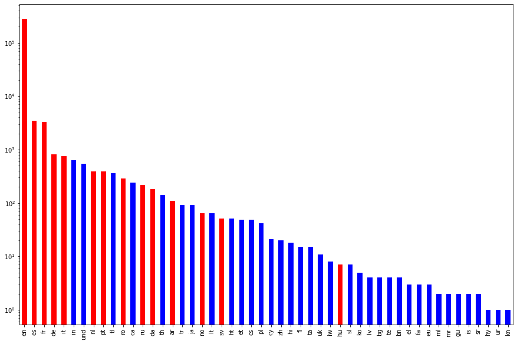
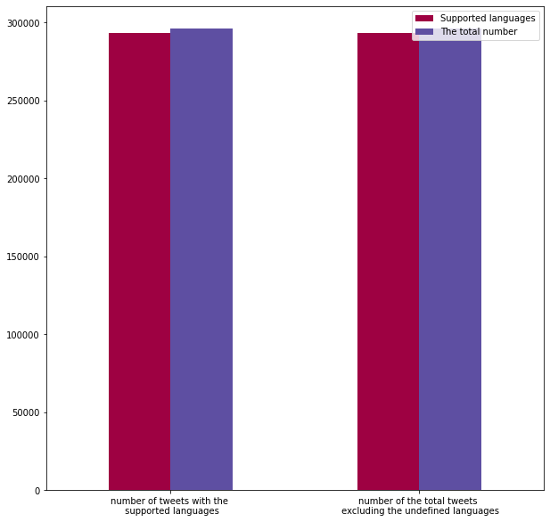

## ZeitZeiton Group- MLinPractice

## Proprecessing 
This application is capable of handling correctly 14 languages, since the used Snowball Stemmer supports the following 14 languages: Arabic, English, Spanish, French, German, Norwegian, Danish, Dutch, Swedish, Italian, Hungarian, Portuguese, Russian and Romanian.
For the mentioned languages, we upload for each language and the corresponding stemmer and the list of the stopwords.

  

The supported languages make up most of the tweets in the dataset. We process the other languages but we are more sure of the accuracy of the results of the supported languages.

  

- first we tokenize the tweet into tokens in *code/tokenizer.py*, i.e, on a word-level. In addition, we get rid of the urls, mentions and tags, since we have these in separates columns.
- after the tokenization, we remove the punctuation within the tokens of the tweet in *code/punctuation_remover.py*
- after the deletion of the punctuation, we remove stopwords within the tokenised tweet with no punctuation. Therefore, we choose the corresponding stopword list depending on the language of the tweet. For now, we have the nltk's stopwords list of the previously mentioned languages. This happens in *code/stopwords_remover.py*
- the last step of the preprocessing:
  - is either the lemmatization. It is only provided for English and it is indeed better than the stemmer, because it is more accurate but we are aware of the price for this accuracy to pay is the time needed for the computations. But unfortunately, we could not find multilingual Lemmatizezr in NLTK, therefore we used a Stemmer. The code is in *code/lemmatizer.py*.
  - or the stemming. We used the SnowballStemmer, since it supports the highest number of languages, namely the 14 mentioned languages. It supposed to remove the stopwords, but it turned out it can not do that well, so we kept the removing of the stopwords. The stemmer is within *code/stemmer.py*.

## Feature Extraction
We have created ten features, we tried to cover the "linguistic" side of the tweet, the interactions with the tweet such as number of "likes", or "retweets", etc.., and the media used in the tweet like images and videos. 
For the linguistic side, we come up with the three following features:
- **bigrams**: first we split all the tweet into bigrams, then we compute the frequency distribution by creating a dictionary with bigrams as keys and the value of their frequency distribution. Then for every tweet, we split it also in bigrams and we get the value of the its frequency distribution from the created dictionary.
We delete the deuplicates, since the value of the frequency distribution captures how many it appears in the set of all tweets. Then we sort them, just for testing. At the end we sum the values of the frequency distribution of the bigrams of the tweet. For example, if the tweet has many bigrams that also occur within the tweets, then it must have a high value, otherwise low number value.

- **popular hashtags**: some tweets have hashtags. Our idea is to see if it popular or not. By popular we mean it is used frequently. Therefore, we chose to use TfidfVectorizer since it captures how characteristic the tweet is. Again, we also sum the vectors of the hashtags used in the tweet. We also sort here only for tasting purposes.

- **sentiment analysis**: first we decided to use [Flair](https://github.com/flairNLP/flair), but due to speed issues, we drop it but it is very accurate in compraison to the other, and it support 15 languages. We ended up using the SentimentIntensityAnalyzer from NLTK. To represent the sentiments, namely "postive", "negative", "neutral", we used OneHotEncoder.
  
- **similar tweets**: to capture how similar the tweets are, we had to first to embed the stemmed tweets using [Sister](https://towardsdatascience.com/super-easy-way-to-get-sentence-embedding-using-fasttext-in-python-a70f34ac5b7c). Since it is easier than implementing it. The MeanEmbedding of Sister takes the embeddings of the words and it averages them. To compute the cosine similarity, we had to slice the sentence embeddings, to prevent a memory error.
  
For the interactive side of the tweet: it is only helpful, in case of the given tweet has these attributes attached to the input. Like the validation and the testing sets. 
- **likes counter**: computes the number of the received likes to the tweet.

- **retweets counter**: computes the number of the received retweets to the tweet.

- **replies counter**: computes the number of the received replies to the tweet.

- **mentions counter**: computes the number of the mentions within the tweet.

For the media of the tweet: it is only helpful, in case of the given tweet has some media attached to the input. Like the validation and the testing sets. 

- **videos counter**: computes the number of the videos attached to the tweet.

- **images counter**: computes the number of the images attached to the tweet.

## Dimensionality Reduction

We implemented one dimensionality reduction method in addition to the preimplemented, namely, the Embedded methods using the Random Forest Classifer with 5 trees. It is also computationally cheap like the wrapper methods. Both methods give result back that the two features, "retweets_count" and "like_count" are the most informative and distinctive features.