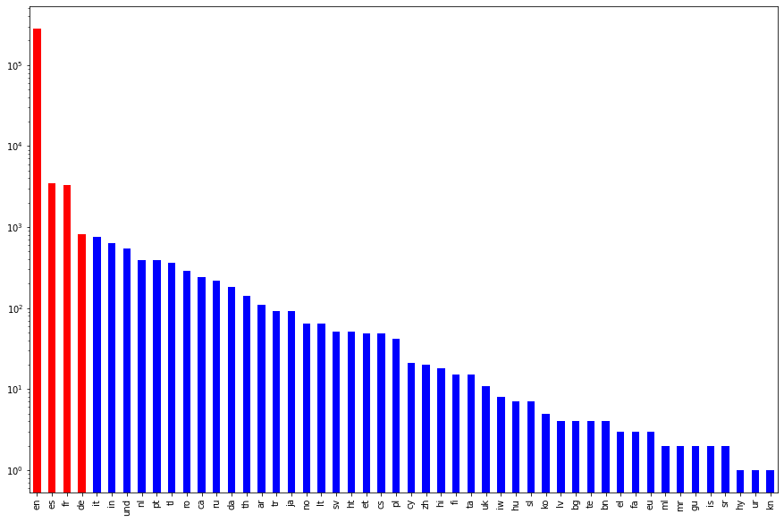

## ZeitZeiton Group- MLinPractice

## Proprecessing 
This application is capable of handling correctly four languages, namely the four most frequent languages: English, Spanish, French and German. For the mentioned languages, we upload for each language and the corresponding lemmatizer and the list of the stopwords.

- first we tokenize the tweet into tokens in *code/tokenizer.py*, i.e, on a word-level. In addition, we get rid of the urls, mentions and tags, since we have these in separates columns.
- after the tokenization, we remove the punctuation within the tokens of the tweet in *code/punctuation_remover.py*
- after the deletion of the punctuation, we remove stopwords within the tokenised tweet with no punctuation. Therefore, we choose the corresponding stopword list depending on the language of the tweet. For now, we have the nltk's stopwords list of the following languages: German, English, Spanish and French. This happens in *code/stopwords_remover.py*
- the last step of the preprocessing is the lemmatization, we use lemmatization instead of stemming, because it is more accurate but we are aware of the price for this accuracy to pay is the time needed for the computations. It is not a big problem, since we run the preprocessing step only one time. The lemmitzation is implemented in *code/lemmatizer.py*.
