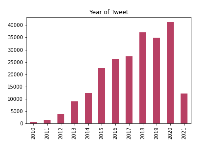
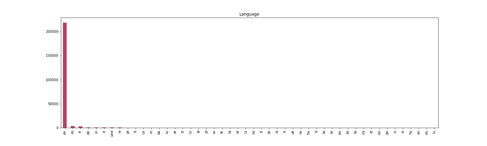
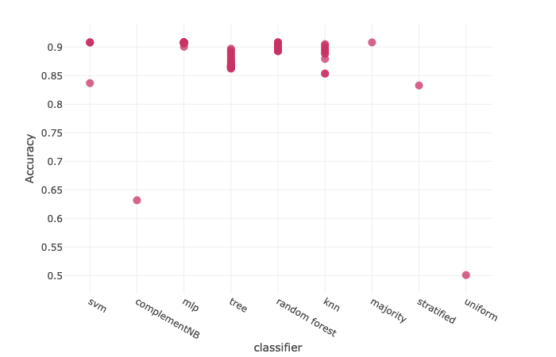
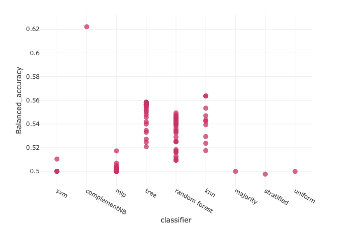
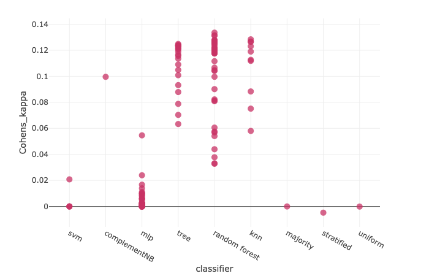
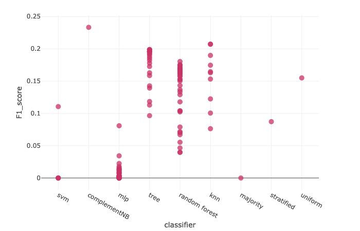
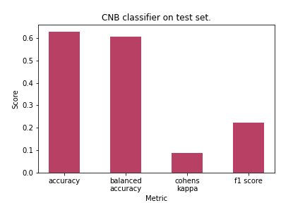

# Documentation
Machine Learning in Practice block seminar, winter term 2021/22 @ [UOS](https://www.uni-osnabrueck.de/startseite/).  
Held by Lucas Bechberger, M.Sc.  
Group members: Dennis Hesenkamp, Yannik Ullrich

---
### Table of contents
1. [Introduction](#introduction)
1. [Preprocessing](#preprocessing)
2. [Feature Extraction](#feature_extraction)
3. [Dimensionality Reduction](#dimensionality_reduction)
3. [Classification](#classification)
4. [Evaluation Metrics](#evaluation)
5. [Hyperparameter Optimization](#param_optimization)
5. [Results](#results)
6. [Conclusion](#conclusion)
6. [Next Steps](#next_steps)
7. [Resources](#resources)

---

<!-- Introduction section -->
<a name='introduction'></a>

## Introduction

This file contains the documentation for our project, which aims to classify tweets as viral/non-viral based on multiple features derived from  

- the metadata of the tweet and
- the natural language features of the tweet.

The data set used is Ruchi Bhatia's [Data Science Tweets 2010-2021](https://www.kaggle.com/ruchi798/data-science-tweets) from [Kaggle](https://www.kaggle.com/). The code base on which we built our machine learning pipeline was provided by Lucas Bechberger (lecturer) and can be found [here](https://github.com/lbechberger/MLinPractice). 

We can see that, over the years, the interest in data science and related topics as grown very fast:

<fig style="align:center">
	
	<figcaption>Fig 1: Tweets per year.</figcaption>
</fig>

Also, most tweets in our data set are written in English, as can be seen here:

<fig style="align:left">
	
	<figcaption>Fig 2: Language distribution of the tweets.</figcaption>
</fig>


<!-- Preprocessing section -->
<a name='preprocessing'></a>

## Preprocessing

The data set provides the raw tweet as it has been posted as well as multiple features related to the tweet, for instance the person who published it, the time it has been published at, whether it contained any media (be it photo, video, url, etc.), and many more. We employed multiple preprocessing steps to transform the input data into a more usable format for feature extraction steps later on.

### Splitting
As a very first step, we split the data set into a training (60%), a validation (20%), and a test set (20%). We will work on the training and validation set to implement everything to then, eventually, test our classifiers on the test set.


### Tokenization
In the lecture, Lucas implemented a tokenizer to disassemble tweets into individual words using the `nltk` library[^nltk]. This is done to split up the raw tweet into its constituents, i.e. the single words and punctuation signs it contains. By doing so, further processing and feature extraction can be performed by looking at the single components of a sentence/tweet as opposed to working with one long string.

Example:  

```python
import nltk

sent = 'There is great genius behind all this.'
nltk.word_tokenize(sent)

# ['There', 'is', 'great', 'genius', 'behind', 'all', 'this', '.']
```


### Stopword Removal
To extract meaningful natural language features from a string, it makes sense to first remove any stopwords occuring in that string. Say, for example, one would like to look at the most frequently occuring words in a large corpus. Usually, that means looking at words which actually carry _meaning_ in the given context. According to the OEC[^oec], the largest 21<sup>st</sup>-century English text corpus, the commonest word in English is _the_ - from which we cannot derive any meaning. Hence, it would make sense to remove words such as _the_ and other, non-meaning carrying words (= stopwords) from a corpus (the set of tweets in our case) before doing anything like keyword of occurence frequency analysis.  

There is not one universal stopword list nor are there universal rules on how stopwords should be defined. For the sake of convenience, we decided to use `gensim`'s `gensim.parsing.preprocessing.remove_stopwords` function[^gensim_stopwords], which uses `gensim`'s built-in stopword list containing high-frequency words with little lexical content.  

Example:  

```python
import gensim

sent = 'There is great genius behind all this.'
gensim.parsing.preprocessing.remove_stopwords(sent)

# 'There great genius this.'
```

Other options would have been `nltk`'s stopword corpus[^nltk_stopwords], an annotated corpus with 2.400 stopwords from 11 languages or `spaCy`'s stopword list[^spacy_stopwords], but we faced problems implementing the former one while `gensim`'s corpus apparently contains more words and leads to better results compared to the latter.


### Punctuation Removal
Punctuation removal follows the same rationale as stopword removal: A dot, hyphen, or exclamation mark will probably occur often in the corpus, but without carrying much meaning at first sight (we can actually also infer features from punctuation, more about that in [Sentiment Analysis](#sentiment_analysis)). A feature for removing punctuation from the raw tweet has already been implemented by Lucas during the lecture using the `string` package. Again, alternatives can be used - for example with `gensim`, which offers a function for punctuation removal[^gensim-punctuation]. We had to rebuild this class as it was initially meant to work as first step in the preprocessing pipeline, but we now have it in second place. Hence, it was necessary to change how the class handles input and output and we needed an additional command line argument. We did not change the method of removing punctuation in general, as there is not much benefit in looking at different ways of punctuation removal anyways, as opposed to stopword removal, where lists can vary a lot based on the corpus.

Example:

```python
import string

sent = "O, that my tongue were in the thunder's mouth!"
punctuation = '[{}]'.format(string.punctuation)
sent.replace(punctuation, '')

# "O that my tongue were in the thunders mouth"
```
Caveat: the above code will actually not produce the desired output, but works in our implementation due to the different format of the input (we pass a `dtype object` as input). This is just to illustrate how our code and punctuation removal in general work.


### Lemmatization
Lemmatization modifies an inflected or variant form of a word into its lemma or dictionary form. Through lemmatization, we can make sure that words - on a semantical level - get interpreted in the same way, even when inflected: _walk_ and _walking_, for example, stem from the same word and ultimately carry the same meaning. We decided to use lemmatization as opposed to stemming, although it is computationally more expensive. This is due to lemmatization taking context into account, as it depends on part-of-speech (PoS) tagging.  

To implement this, we used `nltk`'s `pos_tag` to assign PoS tags and WordNet's `WordNetLemmatizer()` class, as well as a manually defined PoS dictionary to reduce the (rather detailed) tags from `pos_tag` to only four different ones, namely _noun_, _verb_, _adjective_, and _adverb_:

```python
from nltk.corpus import wordnet

tag_dict = {"J": wordnet.ADJ,
			"N": wordnet.NOUN,
			"V": wordnet.VERB,
			"R": wordnet.ADV}
```

This simplified PoS assignment is important because `pos_tag` returns a tuple, which has to be converted to a format the WordNet lemmatizer can work with, further WordNet lemmatizes differently for different PoS classes and only distinguishes between the above mentioned classes. Courtesy to [this blog entry](https://www.machinelearningplus.com/nlp/lemmatization-examples-python/#wordnetlemmatizerwithappropriatepostag) by Selva Prabhakaran for the idea and the code.

Example:

```python
from nltk import pos_tag
from nltk.stem import WordNetLemmatizer

sent = ['These', 'newer', 'data', 'help', 'scientists', 'accurately', 'project', 'how', 'quickly', 'glaciers', 'are', 'retreating', '.']
lem = WordNetLemmatizer()
lemmatized = []

for word in sent:
	# get the part-of-speech tag
	tag = pos_tag([word])[0][1][0].upper()
	lemmatized.append(lem.lemmatize(word.lower(), tag_dict.get(tag, wordnet.NOUN)))
	
# ['these', 'newer', 'data', 'help', 'scientist', 'accurately', 'project', 'how', 'quickly', 'glacier', 'be', 'retreat', '.']
```

Whenever the PoS tagging encounters an unknown tag or a tag which the lemmatizer cannot handle, the default tag to be used is `wordnet.NOUN`.

As mentioned in the beginning, alternatively to lemmatization we could use the computationally cheaper stemming, which only reduces an inflected word to its stem (e.g. _accurately_ becomes _accur_). This could be done with `gensim.parsing.preprocessing.stem`[^gensim_stemming]


### Final Words
The above preprocessing steps have all been tested and work fine. Some of them can be performed independently, but we built the pipeline such that they stack. To ensure proper functionality, the order of steps has to be as follows:

1. Stopword removal
2. Punctuation removal
3. Tokenization
4. Lemmatization

Input columns have to be specified accordingly with the provided command line arguments (see readme for more info).


<!-- Feature extraction section -->
<a name='feature_extraction'></a>

## Feature Extraction
After the preprocessing of the data is done, we can move on to extracting features from the dataset.


### Character Length
The length of a tweet might influence its chance of going viral as people might prefer shorter texts on social media (or longer, more complex ones). This feature was already implemented by Lucas as an example, using `len()`.

Example:

```python
sent = 'There is great genius behind all this.'
len(sent)

# 38
```

This is, however simple it may be, a difficult to interpret feature: for most of its existence, Twitter has had a character limit of 140 characters per tweet. In 2017, the maximum character limit was raised to 280[^twitter_charlength], which led to an almost immediate drop of the prevalence of tweets with around 140 characters while, at the same time, tweets approaching 280 characters appear to be syntactically and semantically similar to tweets around 140 characters from before the change (Gligorić et al., 2020).

<a name='month'></a>
### Month
We thought that the month in which a tweet was published could have (some minor?) influence on its virality. Maybe during holiday season or the darker time of the year, i.e. from October to March, people spend more time on the internet, hence tweets might get more interaction which will lead to a higher potential of going viral.

We extracted the month from the `date` column of the dataframe using the `datetime` package as follows:

```python
import datetime

date = "2021-04-14"
datetime.datetime.strptime(date, "%Y-%m-%d").month

# 4
```

The result we return is the respective month. We have NOT yet implemented one-hot encoding for the result because we actually decided rather quickly that we do not want to use this feature. We could not find evidence or reserach on our assumption that screentime/time on the internet is higher during certain months or periods of the year. How one-hot encoding is done can be seen in [Time of Day](#time_of_day).


<a name='sentiment_analysis'></a>
### Sentiment Analysis
Using the VADER (Valence Aware Dictionary and sEntiment Reasoner)[^vader_pypi] [^vader_homepage] framework, we extract the compound sentiment of a tweet. VADER was built for social media and takes into account, among other factors, emojis, punctuation, and caps - which is why we let it work on the unmodified `tweet` column of the dataframe, ensuring that we do not artificially modify the sentiment. The `polarity_score()` function returns a value for positive, negative, and neutral polarity, as well as an additional compound value with $-1$ representing the most negative and $+1$ the most positive sentiment. The classifier does not need training as it is pre-trained, unknown words, however, are simply classified as neutral. 

Example:

```python
from nltk.sentiment.vader import SentimentIntensityAnalyzer

sia = SentimentIntensityAnalyzer()
sentences = ["The service here is good.", 
			"The service here is extremely good.", 
			"The service here is extremely good!!!", 
			"The service here is extremely good!!! ;)"]

for s in sentences:
 	print(sia.polarity_scores(s)['compound'])
 	
# 0.4404
# 0.4927
# 0.6211
# 0.7389 	
```
We can see how the compound sentiment changes with the addition of words, punctuation, and emojis. We decided to only use the compound sentiment as measure because we felt that this is the most important one. A tweet might have a certain negativity score (indicating, e.g., that it is negatively phrased) because of a few words, while the rest of the tweet is phrased very positively, resulting in a positive compound sentiment. However, compared to a tweet with only neutral phrasing (i.e. a negative score of $0$), it would still be classified as more negative, which would intuitively be wrong.

Nota bene: We added $+1$ to the compound sentiment so that no negative values are returned. We had to do this because the Bayes classifier (see [Bayes Classifier](#bayes_classifier)) cannot handle negative values. The range of possible values is now [0, 2] with 1 representing a neutral tweet, 0 being the most negative and 2 the most positive value.


<a name='time_of_day'></a>
### Time of Day
As opposed to the [Month](#month) feature, which we ended up not using, we felt that the time of the day during which a tweet was posted might very well have an influence on its virality. For example, we suppose that less people are online during the night, decreasing a tweet's virality potential. We decided to split the day into time ranges with hard boundaries:

1. Morning hours from 5am to 9am (5 hours)
2. Midday from 10am to 2pm (5 hours)
3. Afternoon from 3pm to 6pm (4 hours)
4. Evening from 7pm to 11pm (5 hours)
5. Night from 12am to 4am (5 hours)

The time sections are roughly equally sized, with afternoon being the only exception. We decided to split the day like this based on our own experience. We have not tested different splits. Alternatively, one could test 

1. Diffferent time ranges
2. A finer split, i.e. more categories
3. A less fine split, i.e. less categories

We extracted the time from the `time` column of the dataframe and simply used the `split()` method to extract the hour from the string it is stored in, then checked whether the extracted value falls into a predefined range and appened the respective value to a new column. We then one-hot encoded the result to retrieve a binary classification for every entry with `pandas`' `get_dummies()` function.

```python
import pandas as pd

time = ["05:15:01", "07:11:31", "16:04:59", "23:12:00"]
hours = [t.split(":")[0] for t in time]
# ['05', '07', '16', '23']

result = []
for h in hours:
	if hour in range(0, 6):
		result.append(0)
	elif hour in range(6, 11):
		result.append(1)  
	elif hour in range(11, 15):
		result.append(2)
	elif hour in range(15, 19):
		result.append(3)  
	elif hour in range(19, 24):
		result.append(4)
		
pd.get_dummies(result) 

#	05	07	16	23
#0	1	0	0	0
#1	0	1	0	0
#2	0	0	1	0
#3	0	0	0	1
# only yields encoding for 4 variables in this case because 5th category not used
```


<a name='ner'></a>
### Named Entity Recognition
Named entity recognition (NER) aims to identify so-called named entities in unstructured texts. We implemented this feature using `spacy`'s pre-trained `en_core_web_sm` pipeline[^spacy_ner]. It has been trained on the OntoNotes 5.0[^onto_notes] and WordNet 3.0[^wordnet] databases. The following entity types are supported by this model:

```python
import spacy

spacy.info("en_core_web_sm")['labels']['ner']

# ['CARDINAL', 'DATE', 'EVENT', 'FAC', 'GPE', 'LANGUAGE', 'LAW', 'LOC', 'MONEY', 'NORP', 'ORDINAL', 'ORG', 'PERCENT', 'PERSON', 'PRODUCT', 'QUANTITY', 'TIME', 'WORK_OF_ART']
```

The entities can be accessed as follows:

```python
ner = en_core_web_sm.load()
sent1 = "The current Dalai Lama was born in 1935 in Tibet"
sent2 = "Big Data and AI are a hot trend in 2021 on Twitter"

ner(sent1).ents
# (1935, Tibet)

ner(sent2).ents
len(ner(sent2).ents)
# (Big Data, AI, 2021, Twitter)
# 4
```
As can be seen in the above example, the NER does not work perfectly. "Dalai Lama" in the first sentence is a named entity but not recognized as such. However, we still decided to make use of this feature as it classifies most named entities correctly. We counted the number of NEs per tweet and stored the occurences as integer. The pipeline we employed was specifically designed for web language. We went with the version for English - although an abundancy of other languages is available - because the number of tweets in other languages in our dataset is rather low and the model might still capture named entities, even if in another language:

```python
sent3 = "Kanzlerin Merkel hat 16 Jahre der Bundesregierung vorgesessen."
ner.(sent3).ents

# (Kanzlerin Merkel, 16, Jahre, Bundesregierung)
```

Other models are offered as well, the `en_core_web_sm` is a small one designed for efficiency. Alternatively, models with larger corpus or trimmed towards higher accuracy are available. Although using the more efficient version, the feature extraction step still seems to be computationally very expensive.

NER with `nltk` is also possible when utilizing the `pos_tag()` function, it requires a much larger effort, though, as noun phrase chunking and regular expressions have to be used for the classification.


### URLs, Photos, Mentions, Hashtags
In this section, we evaluate whether any of the above have been attached to a tweet as a binary (1 if attached, 0 else). Our thinking here was that additional media, be it a link, pictures, mentions of another account, or hashtags, might influence the potential virality of a tweet. We accessed the respective columns of the dataframe (`url`, `photos`, `mentions`, `hashtags`), in which the entries are stored in a list. Hence, we could simply evaluate the length of the entries. If they exceed a length of 2, the column contains more than just the empty brackets and the tweet contains the respective feature.

Example with URL:

```python
urls = ["[]", "['https://www.sciencenews.org/article/climate-thwaites-glacier-under-ice-shelf-risks-warm-water']", "[]"]

result = [0 if len(url) <= 2 else 1 for url in urls]

# [0, 1, 0]
```

Important: although being stored in lists, the column entries get still evaluated as strings. That is why checking for a length less equal 2 works in this case. The evaluation procedure (checking for the length) is the same for all of the above features.


### Replies
We also figured that the number of replies has an influence on the virality: the more people engage with a tweet and reply to it, the more people see it in their news feed, which again increases reach and interactions. The number of replies are stored as float in the column `replies_count` of the dataframe, so we just have to access that column, make a copy, transform it to a `numpy.array`, and reshape it so the classifier can work with the data later on:

```python
import numpy as np

replies = [0.0, 7.0, 2.0, 49.0]
np.array(replies).reshape(-1, 1)

# array([[ 0.],
#		[ 7.],
#		[ 2.],
#		[49.]])
```


### Retweets and Likes
Retweets and likes follow the same rationale as replies. These are the most obvious features to consider when measuring virality and we just implemented them for the purpose of testing. We did not use them for training our model (since that easily results in an accuracy $>99\%$ and does not tell us anything about _why_ the tweet went viral). The procedure is the same as above: access the respective column, convert it to a `numpy.array`, and reshape it.


<!-- Dimensionality reduction section -->
<a name='dimensionality_reduction'></a>

## Dimensionality Reduction
When considering a large amount of features, we ultimately also have to think about whether they are all useful. Some features might contribute alot to the classification task at hand, while others contribute not at all. When performing classification, large and high-dimensional feature spaces - which can emerge extremely fast due to the curse of dimensionality - can become computationally very costly, so it makes sense to distuingish between important and less important features.

We decided to neither implement new dimensionality reduction methods nor the use the already provided `sklearn.feature_selection.SelectKBest` procedure, since our feature vector was comprised of less than 20 features.


<!-- Classifier section -->
<a name='classification'></a>

## Classification
The data vectores in our dataset have one of two possible labels - __true__ if the tweet went viral, __false__ if not. We are, thus, faced with a binary classification task and need classifiers suited for this kind of task.


### Dummy Classifiers
```python
sklearn.dummy.DummyClassifier
```

Dummy classifiers make predictions without any knowledge about patterns in the data. We implemented three of them with different rules to explore possible baselines to which we could compare our real classifiers later on:

- Majority vote: always labels data as the most frequently occuring label in the data set, in our case __false__.
- Stratified classification: uses the data set's class distribution to assign labels.
- Uniform classification: makes random uniform predictions.


### _k_ - Nearest Neighbor
```python
from sklearn.neighbors import KNeighborsClassifier
```
The _k_-NN classifier was implemented by Lucas during the lecture. We use it with only one hyperparameter - _k_ - for our binary classification task. This algorithm is an example for instance-based learning. It relies on the distance between data points for classification, hence it requires standardization of feature vectors.

We decided to additionally implement a way to change the weight function. As default, the `KNeighborsClassifier` works with uniform weights, i.e. all features are equally important. Having an additional option for distance-weighted classification where nearer neighbors are more important than those further away made sense for us (and it also improved our results, as can be seen later).

Other than that, though, we left the classifier with default settings. A notable alternative could have been the choice of the algorithm for computation of the nearest neighbors, options being a brute-force search, _k_-dimensional tree search, and ball tree search. The default option is `auto`, where the classifier picks the method it deems fittest for the task at hand.


<a name='decision_tree'></a>
### Decision Tree
```python
from sklearn.tree import DecisionTreeClassifier
```

Further, we implemented a decision tree classifier. Due to its nature of learning decision rules from the dataset, it does neither require standardization of data nor does it make assumptions on the data distribution.

We added the option to define a maximum depth of the tree, which is extremely important to cope with overfitting. Further, the criterion for measuring split quality can be chosen between Gini impurity and entropy/information gain. The former is usually preferred for classification and regression trees (CART) while the latter is used for the ID3 variant[^id3] of decision trees. Although `sklearn` employs a version of the CART algorithm, it nonetheless works with entropy as measure.

Decision trees generally have difficulties working with continuous data and we have the compound sentiment (see [Sentiment Analysis](#sentiment_analysis)) as feature of such nature which is continuous in the range $[-1, 1]$ (although a case could be made for it being a discrete feature since it is rounded to four decimal places).


### Random Forest
```python
from sklearn.ensemble import RandomForestClassifier
```

Random forest classifiers represent an ensemble of multiple decision trees. They are often more robust and accurate than single decision trees and less prone to overfitting and can, therefore, better generalize on new, unseen data (Breiman, 2001). Random forests are able to deal with unbalanced datasets by down-sampling the majority class such that each subtree works on more balanced data (Biau and Scornet, 2016).

We implemented it such that we can modify the number of trees per forest, the maximum depth per tree, as well as the criterion based on which a split occurs. The options for this are the same as for single decision trees - Gini impurity and entropy. The first two are the main parameters to look at when constructing a forest according to `sklearn`'s user guide on classifiers[^sklearn_forest]. Usually, the classification is obtained via majority vote of the trees in a forest, but this implementation averages over the probabilistic class prediction of the single classifiers.

Being able to manipulate both the maximum depth as well as the split criterion further allows us to compare the forest to our single decision tree classifier, since we can use the same parametrization for both.


### Support Vector Machine
```python
from sklearn.svm import SVC
```

We also added a support vector machine (SVM). This classifier seeks to find a hyperplane in the data space which maximizes the distance between different classes. It can easily deal with higher-dimensional data by changing the kernel (application of the so-called kernel-trick). `sklearn` offers to choose between a linear, polynomial (default degree: 3), radial basis function, and sigmoid kernel. We decided to implement a way to change the kernel, as this can highly affect the outcome of the classifier.

SVMs are sensible to unscaled data and require standardization of the input, which we carried out using the `StandardScaler()` from `sklearn.preprocessing`. Class weights can be set by the parameter `class_weight` to deal with unbalanced data sets, we did not implement this parameter.


### Multilayer Perceptron
```python
from sklearn.neural_network import MLPClassifier
```

The multilayer perceptron (MLP) consists usually of at least three layers: one input layer, one hidden layer, and one output layer. We implemented it such that we can define the number of hidden layers as well as the number of neurons per layer. It should be noted that `sklearn`'s implementation of the MLP stops after 200 iterations if the network has not converged to a solution by then.


### Naive Bayes
```python
from sklearn.naive_bayes import ComplementNB
```
As a sixth (and last) classifier, we implemented one of the naive Bayes variants that `sklearn` offers. The two classic variants are Gaussian and multinomial Bayes, yet, we chose the complement naive Bayes (CNB) algorithm as it was specifically designed to deal with unbalanced data and addresses some of the shortcomings of the multinomial variant (Rennie, Shih, Teevan, Karger, 2003).

No additional parameters to adapt were implemented. Alternatively, we could have implemented command line argument for the smoothing parameter alpha, which adds Laplace smoothing and takes care of the zero probability problem. The default value here is $1$, which is also the preferred value in most use cases. Hence, we did not deem modification necessary.


<!-- Evaluation section -->
<a name='evaluation'></a>

## Evaluation Metrics
We implemented multiple evaluation metrics to see how well our classification works and to compare the different classifiers described above.


### Accuracy
The accuracy - or fraction of correctly classified samples - might just be simplest statistic for evaluation of a classification task. It can be calculated as follows:

$$
\text{Accuracy} = \frac{TP + TN}{N}
$$

$TP$: True positive, correctly positively labeled samples  
$TN$: True negative, correctly negatively labeled samples  
$N$: Total number of samples

The best value is $1$ ($100\%$ correctly classified samples), the worst $0$.

### Balanced Accuracy
The balanced accuracy is better suited for unbalanced data sets. It is based on two other commonly used metrics, the sensitivity and specificity (see section [F<sub>1</sub>-Score](#f1_score) for more details). Its calculation works as follows:

$$
\text{Balanced accuracy} = \ \frac{\text{Sensitivity} + \text{Specificity}}{2}
$$

Again, values can range from $0$ (worst) to $1$ (best). This metric makes a much better statement about the quality of a classifier when the majority of samples belongs to one class, as in our case with the label '_false_', because it takes into account both how many samples were correctly classified as _true_ and correctly classified as _false_. Consider an example with $1\%$ of the data points belonging to class A and a classifier always assigning the other class (B) as label. This would yield an accuracy of $99\%$ as that would be the fraction of correctly classified samples. Balanced accuracy, however, would return a value of $0.5$ as no sample with class A had been correctly identified, while all class B samples were correctly labeled.


### Cohen's Kappa
Cohen's kappa is another metric which is said to be very robust against class imbalance and, therefore, well suited for our task.

Calculation:
$$
\text{Cohen's kappa} = \frac{\text{Accuracy} - p_e}{1 - p_e}
$$

with

$$
p_e = p(\text{AC = T}) * p(\text{PC = T}) + p(\text{AC = F}) * p(\text{PC = F})
$$

where $p$ denotes the probability, $p_e$ specifically designates the expected agreement by chance, $AC$ and $PC$ are the actual and predicted class, and $T$ and $F$ true and false, i.e. the class labels. This metric takes into account that correct classification can happen by chance. Values can range from $-1$ to $1$, with negative values meaning correct classification by chance and $1$ representing complete agreement.


<a name='f1_score'></a>
### F - Score
The F<sub>&beta;</sub>-Score is a measure which combines precision and recall and returns a single value. The relative contribution from precision and recall can be adjusted with the &beta;-value: $1$ encodes equal weight of the two measures, while a value closer to $0$ will weigh precision stronger and &beta; $> 1$ favors the recall. We chose to implement the standard score with &beta; $= 1$, as we deem both precision and recall equally important. It can be calculated as follows:

$$
F_{\beta} = (1 * \beta) \frac{\text{Precision} * \text{Recall}}{(\beta^2 * \text{Precision}) + \text{Recall}}
$$

with

$$
\text{Precision} = \frac{TP}{TP + FP}
$$

and 

$$
\text{Recall} = \frac{TP}{TP + FN}
$$

Values range from $0$ (worst) to $1$ (best).


<a name='param_optimization'></a>
## Hyperparameter Optimization
`mlflow ui --backend-store-uri data/classification/mlflow`

After having done preprocessing and feature extraction, chosen evaluation metrics, and decided on the classifiers to employ with what kind of parameters, we ran different configurations on the training and validation set to find the most promising classifier and hyperparameter set. Listing the results of every possible combination would go beyond the scope of this documentation, which is why we will only provide an overview over all tested combinations and the most notable results. We tracked all results using the `mlflow` package, which allows for very convenient logging of the used parameters and metrics.


### _k_ - Nearest Neighbor
<!-- K NEAREST NEIGHBOR -->
For the _k_-NN classifier, we tested the following parameter combinations:

<table>
<tbody>
  <tr>
    <td><b>Weight</b></td>
    <td style="text-align:center" colspan="5">Uniform</td>
    <td style="text-align:center" colspan="5">Distance</td>
  </tr>
  <tr>
    <td><b>k</b></td>
    <td>1</td>
    <td>3</td>
    <td>5</td>
    <td>7</td>
    <td>9</td>
    <td>1</td>
    <td>3</td>
    <td>5</td>
    <td>7</td>
    <td>9</td>
  </tr>
</tbody>
</table>

We used only odd numbers for _k_ to avoid a tie since our task is binary classification (for an odd number of classes, the inverse holds true: even _k_-values avoid ties).


<!-- DECISION TREE -->
### Decision Tree
For decision trees, we explored the following hyperparameter space:

<table>
<tbody>
  <tr>
    <td><b>Criterion</b></td>
    <td style="text-align:center" colspan="9">Gini impurity</td>
  </tr>
  <tr>
    <td><b>Max depth</b></td>
    <td>16</td>
    <td>18</td>
    <td>20</td>
    <td>22</td>
    <td>24</td>
    <td>26</td>
    <td>28</td>
    <td>30</td>
    <td>32</td>
  </tr>
  <tr>
    <td><b>Criterion</b></td>
    <td style="text-align:center" colspan="9">Entropy</td>
  </tr>
  <tr>
    <td><b>Max depth</b></td>
    <td>16</td>
    <td>18</td>
    <td>20</td>
    <td>22</td>
    <td>24</td>
    <td>26</td>
    <td>28</td>
    <td>30</td>
    <td>32</td>
  </tr>
</tbody>
</table>

Additionally, we built the tree without depth restriction for both split criterions.


<!-- RANDOM FOREST -->
### Random Forest
The random forest classifier comes with the added parameter of a set number of trees per forest:

<table>
<tbody>
  <tr>
    <td><b>Trees per forest</b></td>
    <td>10</td>
    <td>25</td>
    <td>50</td>
    <td>100</td>
  </tr>
</tbody>
</table>

For each possible number of trees per forest, we explored the same space as with the single decision tree. Further, we also built one tree without depth restriction for each possible combination of tree number and split criterion. A high number of trees per forest usually results in better and more solid results, especially in terms of avoiding overfitting.


### Support Vector Machine
We tested the SVM classifier with four different kernels:

<table>
<tbody>
  <tr>
    <td><b>Kernel</b></td>
    <td>linear</td>
    <td>polynomial</td>
    <td>radial basis function</td>
    <td>sigmoid</td>
  </tr>
</tbody>
</table>

The computational cost for the SVM classifier seems very high and execution of training and validation took extremely long.

<!--MULTILAYER PERCEPTRON -->
### Multilayer Perceptron
We tried many different combinations for the MLP classifier: we built it first with only one hidden layer (which means three layers in total, one additional layer for input and output), then with two and three hidden layers. We tried every possible combination of neurons per hidden layer from the set of (10, 25, 50), which yields a total of 39 combinations. The hyperparameter space for a network with three hidden layers and 10 neurons in hidden layer 1 would, e.g., look like this:

<table>
<tbody>
  <tr>
    <td><b>Layer 1</b></td>
    <td style="text-align:center" colspan="9">10</td>
  </tr>
  <tr>
    <td><b>Layer 2</b></td>
    <td style="text-align:center" colspan="3">10</td>
    <td style="text-align:center" colspan="3">25</td>
    <td style="text-align:center" colspan="3">50</td>
  </tr>
  <tr>
    <td><b>Layer 3</b></td>
    <td>10</td>
    <td>25</td>
    <td>50</td>
    <td>10</td>
    <td>25</td>
    <td>50</td>
    <td>10</td>
    <td>25</td>
    <td>50</td>
  </tr>
</tbody>
</table>

Additionally, we followed a promising lead and also trained a network with the hidden layer structure (100, 100, 100). After 200 iterations, the training was abandoned because the network had still not converged - nonetheless delivering the best result we observed thus far with the MLP. We also decided not to explore any combinations with higher number of neurons because of the computational cost. 


<!-- COMPLEMENT NAIVE BAYES -->
### Naive Bayes
Since we did not implement any hyperparameters to adjust, we only ran the CNB classifier once.


<a name="results"></a>
## Results
An important note right away: we did not use the grid of our institute for the hyperparameter optimization but only ran the classifier on a local machine. The results we obtained are from a naive exploration of the search space. We tried to narrow down interesting and promising configurations and ranges for every classifier by manual testing. Hence, we might have obtained results that are only local optima.

The results per classifier for our evaluation metrics on the validation set can be seen in the figures below:

<div style="background:transparent">
<figure>
  
  <figcaption>Fig 3: Accuracy per classifier</figcaption>
</figure>  
<figure>
  
  <figcaption>Fig 4: Balanced accuracy per classifier</figcaption>
</figure>  
<figure>
  
  <figcaption>Fig 5: Cohen's kappa per classifier</figcaption>
</figure>  
<figure>
  
  <figcaption>Fig 6: F<sub>1</sub>-score per classifier</figcaption>
</figure>  
</div>

Figure 3 shows that the majority of classifiers and configurations achieve a high accuracy, the CNB being an exception while the uniform classifier achieves an accuracy of 0.5, as expected. As already discussed earlier in the section [Evaluation Metrics](#evaluation), this measurement does, unfortunately, not tell us much about the actual quality of the classifier. 

In Figure 4, we can see that none of our classifiers performs much better than the balanced accuracy baseline of 0.5. This value can easily be obtained by classifying most to all of the tweets as _false_. Only the CNB pulls ahead with achieving a score og 0.622, which is still rather low.

Looking further at Cohen's kappa in Figure 5, we can now see more of a difference in the performance of the configurations. The random forest classifier with 25 trees, Gini impurity, and no specified maximum depth performs best with a value of 0.134. We can see that especially the MLP and SVM cofigurations are not useful as well. Decision tree, random forest, and _k_-NN have a similar performance, CNB scores equally well, given that only one configuration was run.

Figure 6 displays the F<sub>1</sub>-score, showing a similar picture to Figure 5: SVM and MLP do not perform well, while decision tree, random forest, and _k_-NN are again quite level in terms of mean score. We can see that even the uniform dummy classifier performs on par with our other classifiers, since it probably assigns the correct label to about half of the positive samples. Again, CNB leads the field with a score of 0.233.

Given the above results, we decided that the CNB classifier is the best choice to run on our test set. It performed best on both the balanced accuracy and F<sub>1</sub>-score, while being average on the Cohen's kappa metric.


<a name='conclusion'></a>
## Conclusion
<figure>
  
  <figcaption>Fig 7: Final result on test set.
</figcaption>
</figure>  

Figure 7 shows the result of our CNB classifier on the test set. The scores resemble those achieved on the validation set quiet closely, which confirms our choice.

In the end, we based our classifier decision not on one single metric as we had initially planned, but looked at a combination of values. That CNB worked best overall caught us by surprise, although we might just have been biased by the many configurations tested with the other classifiers compared to the single one from CNB. A random forest with Gini impurity split criterion and unlimited depth would be our second choice, the number of trees should be at least 25 (higher numbers did not yield better results, but they are possibly more robust to overfitting).

We decided to drop accuracy as decision-influencing metric because of its drawbacks when working with unbalanced data. The scores on the other three metrics are still not very satisfactory and leave much room for improvement. Our pipeline cannot be considered production ready at this point due to its substandard performance. This might have different reasons.

First of all, the features we extracted are largely metadata based. We have only implemented two natural language based features, namely the sentiment score and the named entity recognition. But even these two are without error, as our examples have shown. Sometimes, they fail to label even simple examples correctly (see sections [Sentiment Analysis](#sentiment_analysis) and [Named Entity Recognition](#ner) again for details). It could be that the features we extracted just do not capture what exactly makes a tweet go viral. There has been research into virality in the past, but it is not easy to capture what exactly helps a tweet (or any piece of media, for that matter) to become popular. Marketing agency OutGrow has put together an infographic with some aspects that seem to play a role in making content shareworthy[^outgrow].

Further, we only did a naive hyperparameter optimization. It is possible that we found solutions only in a local optimum, while there are much more suitable classifier setups. In Figures 4-6, we can, for example, see that one MLP configuration, namely the one with hidden layer structure (100, 100, 100), outperforms the other MLPs. In this particular case, our hyperparameter space exploration was limited due to computational capability, training more complex networks has simply been not feasible for us.

On the other hand, when testing the decision tree and random forest classifiers, we also let one tree or forest grow to full depth per parameter combination. We figured this might lead to overfitting on the validation set, but the unrestricted depth configurations actually achieved best (in one case second-to-best) performance, i.e. for each evaluation metric the best performing trees and random forests where those which could grow until the end.


<a name='next_steps'></a>
## Next Steps
After having discussed the results and possible shortcomings of our pipeline, we would like to point out directions for further reseach.

As already mentioned, we only implemented two natural language grounded features. It is likely that a greater focus on this kind of feature will lead to better classification results. One could, e.g., consider _n_-grams, word importance measures like tf-idf, or constituency parsing and dependency parsing to measure syntactic complexity. There might also be more interesting (and more obvious) metadata features as the number of followers of a Twitter account or the history of viral posts of an account. Such features, though, seem less interesting compared to actual language based featurea - at least to us.

A more thorough and thought-through implementation of classifiers based on our first results is another feasible direction. This work can be understand as laying out some groundwork to possibly built on.

Lastly, it should not be forgotten that we worked only with a data set containing tweets about data science. While making it probably easier to work with features such as keywords when narrowing the domain, it is also much harder to get large data sets and find general patterns in the data that can be applied to new data.


<a name='resources'></a>
## Resources
<https://towardsdatascience.com/comparative-study-on-classic-machine-learning-algorithms-24f9ff6ab222>


<!-- Footnotes -->
[^nltk]: <https://www.nltk.org/>
[^oec]: <https://web.archive.org/web/20111226085859/http://oxforddictionaries.com/words/the-oec-facts-about-the-language>, retrieved Oct 26, 2021
[^nltk_stopwords]: <https://www.nltk.org/book/ch02.html>, retrieved Oct 26, 2021
[^gensim_stopwords]: <https://radimrehurek.com/gensim/parsing/preprocessing.html#gensim.parsing.preprocessing.remove_stopwords>, retireved Oct 26, 2021
[^spacy_stopwords]: <https://github.com/explosion/spaCy/blob/master/spacy/lang/en/stop_words.py>, retrieved Oct 26, 2021
[^gensim-punctuation]: <https://radimrehurek.com/gensim/parsing/preprocessing.html#gensim.parsing.preprocessing.strip_punctuation>, retrieved Oct 26, 2021
[^gensim_stemming]: <https://radimrehurek.com/gensim/parsing/preprocessing.html#gensim.parsing.preprocessing.stem>, retrieved Oct 26, 2021
[^vader_pypi]: <https://pypi.org/project/vaderSentiment/>, retrieved Oct 15, 2021
[^vader_homepage]: <https://github.com/cjhutto/vaderSentiment>, retrieved Oct 15, 2021
[^twitter_charlength]: <https://blog.twitter.com/official/en_us/topics/product/2017/Giving-you-more-characters-to-express-yourself.html>
[^sklearn_forest]: <https://scikit-learn.org/stable/modules/ensemble.html#forest>
[^mlflow]: <https://mlflow.org/docs/latest/index.html#>
[^onto_notes]: <https://catalog.ldc.upenn.edu/LDC2013T19>
[^wordnet]: <https://wordnet.princeton.edu/>
[^spacy_ner]: <https://spacy.io/usage/models>
[^outgrow]: <https://outgrow.co/blog/infographic-science-behind-virality>
<!-- -->
