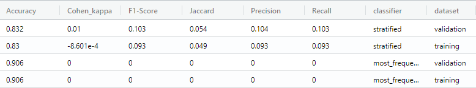
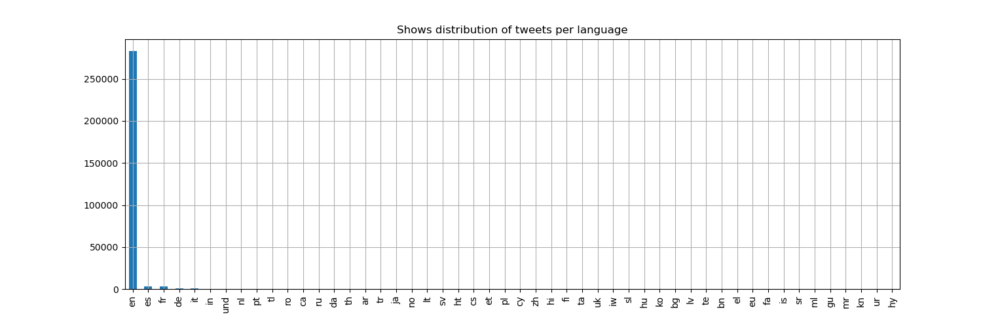
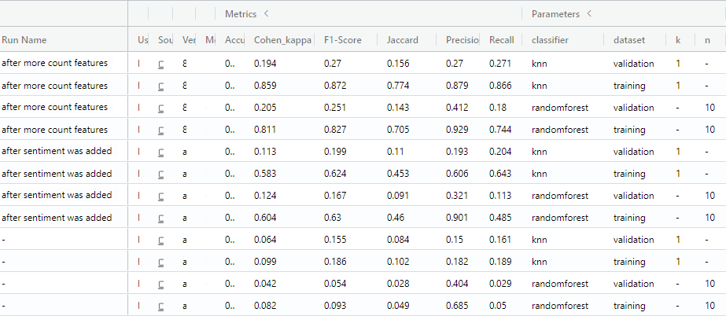

# Documentation - [Patoali](https://trello.com/b/3pj6SkWa)

This document presents the author's work on the 'Machine Learning in Practice' project which took place during the summer term 2021 as a block seminar at Osnabrück University. The given task was to analyze a data set containing data science related tweets and predict whether a tweet will go viral or not by applying machine learning techniques. A tweet is defined as viral if it exceeds the arbitrary threshold of the sum of 50 likes and retweets. The data set _Data Science Tweets 2010-2021_ contains _data science_, _data analysis_ and _data visualization_ tweets from verified accounts on Twitter from 2010 til 2021. It was collected and [shared on kaggle.com](https://www.kaggle.com/ruchi798/data-science-tweets) by Ruchi Bhatia.

The lecturer Lucas Bechberger provided his students with a foundational codebase which makes heavy use of the python library scikit-learn. The codebase consists of multiple python (`.py`) and bash (`.sh`) scripts that resemble a basic pipeline of the processing steps _preprocessing_, _feature extraction_, _dimensionality reduction_ and _classification_ which is common for machine learning projects. The shell scripts invoke the python scripts with a particular set of command line arguments. Shell scripts can be used to run the entire pipeline or to execute only individual steps to save time. Results of the pipeline steps are stored in `.pickle` files to reuse them in a separate application. The application offers a rudimentary read–eval–print loop to predict the virality of the tweet a user inputs. The students task was to understand the code base and extend or replace given placeholder implementations with proper solutions to measure and improve the virality prediction.

## Evaluation

Before taking a look at the implemented metrics for judging the prediction performance of various models, some specifics about the data set at hand need to be considered. The raw data consists of the three `.csv` files _data science_, _data analysis_ and _data visualization_. In a first preprocessing step they are appended respectively to form one big data set. In a next step the data is labeled as viral or not viral according to the above mentioned threshold rule. The resulting data set consists of 295,811 tweet records with a distribution of 90.82% non-viral and 9.18% viral tweets. Such an uneven distribution of labelling classes is often referred to as an imbalanced data set. This fact has to be taken into account when comparing the results of baselines with classifiers and the selection of suitable metrics.

    

Fig. 1. Shows the performance of the sklearn DummyClassifier with the strategies 'stratified' and 'most_frequent' on a training and validation data set for all implemented metrics.

For the baselines a `DummyClassifier` from the sklearn package was used with the `strategy` `most_frequent` and `stratified`. The former determines non-viral tweets as the most frequent class and therefore predicts every sample as non-viral. [Fig. 1](#baselines) shows that this rather dumb prediction strategy results in a high accuracy of 90.6%. This is the case, because the calculation of the accuracy metric is based on how many predictions have been correct. Since the data set contains mostly non-viral tweets, the prediction is correct most of the time with a percentage that is similar to the data set's class distribution. The slight difference in the percentage can be explained by the removal of some samples during the preprocessing step.

The `stratified` strategy makes prediction by respecting the training set’s class distribution. Again the accuracy has a high value of 83.2% on the validation set. In two observations the accuracy metric performs well on baselines indicating that it is not useful for the imbalanced data set and therefore can be dismissed entirely. The other metrics _Precision_, _Recall_, _F1-score_, _Cohen's Kappa coefficient_ and _Jaccard score_ are not null this time, but still have a very low value roughly between 0 and 0.1 which is a bad result. Some considerations about the remaining metrics are discussed in the following paragraphs.

When selecting metrics, the use case should be taken into account. An average twitter user would expect that most send tweets will not go viral. When such a user would type a potential tweet into our application to find out if it is going to be viral, it is important to detect a tweet which would go viral as such. This can be captured by the recall metric which asks the question _"How many of the true positives did I catch?"_. On the other hand, it would be annoying if the application is not critical enough and classifies a lot of tweets as viral that don't go viral in practice. Such a high rate of false positives is captured by the precision metric which asks _"How many positively classified ones are actually positive?"_. Therefore, both recall and precision are good metrics for the use case. As an addition the F1-score, which combines both recall and precision as a weighted average, is also used.

Furthermore, Cohen's Kappa is a good condidate for an imbalanced data set. In its calculation the accuracy is used, but adjusted by the probability of random agreement and therefore considered as a more robust measure than simple percent agreement calculations. Additionally, the Jaccard score leaves out false negatives in its calculation. Since it can be expected that this is the most frequently appearing type of result in a confusion matrix, the Jaccard score is also well-suited for the data set. All in all, the metrics _Cohen's Kappa_, _F1-score_, _Jaccard score_, _precision_ and _recall_ are used to judge about the models prediction performance by comparing the scores of the model two the scores of the chosen baselines.

## Preprocessing

In this section it is explains what kind of preprocessing operations are applied to prepare the data for the feature extraction and training in later steps of the pipeline to achieve the best possible prediction performance.

### Preprocessing in General & Provided Preprocessors

After the above mentioned actions of appending the raw data set to a big one and labeling it, a few more preprocessing operations are performed. These operations are useful to improve the performance of models. Usually models cannot process prose or text in general and therefore need the textual data to be tranformed into numerical values. The applied operations are organized in their own preprocessor classes by inheriting from the sklearn classes `BaseEstimator` and `TransformerMixin`. The first two preprocessors `PunctuationRemover` and `Tokenizer` were already provided by the lecturer. The former removes punctuation ASCII characters from the tweet column and saves the result in a new column. This should result in mostly pure text. The latter takes a text column as the input and splits the text into an array of one word per element. The resulting data of both preprocessors is well-suited to perform NLP techniques on it during the feature extraction step.

### NonEnglishRemover & ColumnDropper

Two more processors are implemented. First, the `NonEnglishRemover` removes all data rows that are labelled as being non-english. This was done after exploring and visualizing the data set in [`visualization.py`](../src/visualization.py). As can be seen in [Fig. 2](#tweets-language) the majority of tweets is labelled as english (95.57%). The removal of non-english tweets is useful, because most pre-trained NLP models or other NLP techniques are optimized for english texts. Additionally, the next biggest languages only has 3492 records, which is to little to perform any meaningful machine learning on it. It should be noted though, that there are still some non-english tweets in the data set after performing the operation, because they were labeled wrong. Because this misslabeling is seldom, they can be regarded as noise and must not be further taken into account.
Second, the `ColumnDropper` removes columns that are not needed. This is simply for the convenience of having less columns when looking at the preprocessed data set which is saved as an intermediate data set.

    

Fig. 2. The majority of tweet records are labelled as english. The amount of non-english tweets is too small to be usefull for machine learning.

### TweetCleaner (removes hashtags, URLs and usernames)

Further obvious preprocessing operations are the removal of hashtags, URLs and twitter usernames from the tweet, because various NLP techniques would otherwise come across unknown words and expressions which would decrease the performance. The implementation of this preprocessor was done in the `Tweetclean` branch, but not entirely finished and therefore not used in any features. Just for the record, the preprocessor was mostly implemented by a team member who dropped out of the course.

## Feature Extraction

Besides the already given `CharacterLengthFE`, two more feature extractors have been implemented, namely `CounterFE` and `SentimentFE`. The former is applied to multiple columns and thereby creates multiple features. In general, the feature extractors inherit from a custom `FeatureExtractor` class which in turn inherits from the sklearn classes `BaseEstimator` and `TransformerMixin`. This is done to collect the features and store them in a `.pickle` file for later use in the application.

### CounterFE

Parses the string in every cell of the column/series as an array
        and counts the length in the cell of the output column

The `CounterFE` takes an input column which contains in principle a list of items and counts them. But because the data set is read from file the list in every data cell of the column is wrapped in double quotes as a string. Therefore the string needs to be parsed as a python list by applying (`pandas.DataFrame.apply` [^1]) the `litera_eval` function [^2] from the `ast` package. Then the length of the list for each cell is saved by outputting a column with single integer values in a new column. The new column keeps the original name plus an appended `_count`. 

The data set contains the countable columns *mentions*, *photos*, *hashtags*, *urls*, *cashtags*, *reply_to* and *tweet_tokenized*. The motivation for chosing these columns was to gain information about the virality of a tweet by counting for example the amount of photos, used hashtags and urls. The following table shows an example what the input for the hashtag column could look like and the corresponding output of the feature extractor.

| input coulmn                                                      | output column |
|-------------------------------------------------------------------|-------------- |
| "['energy', 'visualization', 'data']"                             | 3             |
| "[]"                                                              | 0             |
| "['flutter', 'webdevelopment', 'mobiledev', 'datavisualization']" | 4             |

### SentimentFE

The `SentimentFE` feature extractor makes use of a sentiment analyzer. The idea is to analyze the sentiment of the tweet text itself by passing it as an input column. It is assumed that tweets which elicit a strong positive or negative emotion are more likely to go viral. For this task the VADER (Valence Aware Dictionary and sEntiment Reasoner) analysis tool was used. It is a lexicon and rule-based tool specifically attuned to sentiments expressed in social media. [^3] VADER even supports slang and takes the author's emphasis by capitalizing words into account. Therefore, it should be well-suited for analyzing tweets.

VADER is applied on the tweet and automatically analyzes the sentiment of the whole tweet, even if it contains multiple sentences. The calculated *positive*, *neutral* and *negative* polarity scores are floating point number between 0 and 1 that sum up to a total of 1. Only the positive and negative scores are used, since the neutral score is always the remaining value to sum up to 1 and therefore contains no new information. Both scores are stored in the output column. It is noteworthy that VADER also offers a compound score which is a normalized, weighted composite score in a single number between -1 and 1. The following table shows a few example input texts and their corresponding VADER scores. Using the compound score value probably would have  been a better alternative to using the positive and negative score because the first two examples demonstrate how the compound score takes capitalization emphasis into account which the positive score seems to not do.

| input                                                    | output                                                        |
|----------------------------------------------------------|---------------------------------------------------------------|
| VADER is smart, handsome, and funny.                     | {'pos': 0.746, 'compound': 0.8316, 'neu': 0.254, 'neg': 0.0}  |
| VADER is VERY SMART, uber handsome, and FRIGGIN FUNNY!!! | {'pos': 0.706, 'compound': 0.9469, 'neu': 0.294, 'neg': 0.0}  |
| Today SUX!                                               | {'pos': 0.0, 'compound': -0.5461, 'neu': 0.221, 'neg': 0.779} |
| Catch utf-8 emoji such as 💘 and 💋 and 😁              | {'pos': 0.279, 'compound': 0.7003, 'neu': 0.721, 'neg': 0.0}  |
| Not bad at all                                           | {'pos': 0.487, 'compound': 0.431, 'neu': 0.513, 'neg': 0.0}   |

## Classification & Results

This section gives insights into experimentations with dimensionality reduction and the motivation for using a random forest for the classification task. Furthermore, first results are presented. Also, two types of grid searches have been implemented and their results are discussed. Finally, a verdict about the overall performance is expressed, especially in comparison to the baselines. Furthermore considerations for improving the performance and making the application useful are given.

### Dimensionality Reduction

First off, it was experimented with the already implemented dimensionality reduction technique `SelectKBest`. When selecting the two best (`k=2`) best features, the resulting non-accuracy metrics after training are all 0. This shows that the two best features alone don't contain enough information for any learning to happen. Therefore, the argument `all` is used to ignore the dimensionality reduction and select every feature instead. The amount of features is still small enough so that simply training on all features is possible in reasonable time.

### KNeighborsClassifier & RandomForestClassifier

The implemented classifiers are `KNeighborsClassifier` (k-nearest neighbors) and `RandomForestClassifier`. The former was already provided by the lecturer; the latter was chosen, because a random forest can be considered as a kind of universal machine learning technique that works very well out of the box on a multitude of data sets according to Jeremy Howard. He further describes some of the properties of a random forest in his introductory Machine Learning lecture on YouTube: [^4]
- It can predict multiple data types like categories (classification) or continous variables (regression).
- It can predict with both structured and unstructured data type columns like pixels, zip codes, revenues and so on. 
- In general, a separate validation set is not needed, since it generalizes well even if there is only one data set present.
- It generally does not overfit too badly and it is very easy to prevent overfitting.
- It makes few, if any, statistical assumptions like assuming that the data is normally distributed, that the relationship is linear or that you have certain interactions.
- Feature engineering processing like taking the log of the data or multiplying interactions together is not needed.

So all in all, a random forest classifier seems like a good first candidate to implement when no strong assumption are made about the data.

### Early Results and Their Improvement Through Additional Features

Initially only features for the length of the mentions and photos column as well as the character length of a tweet were implemented. The last four rows in [Fig. 3](#early-results) show the results of the classification at this point in time for the k-nearest neighbors classifier (KNN) with `k=1` and the random forest (RF) classifier with `n=10` estimators, meaning the number of trees in the forest. Other than that default parameters were used. The metrics for both the training and validation set are quite bad. For example the Cohen's Kappa coefficient for both classifiers barely reaches the 0.1 mark on the training set. For the validation set it is even a bit worse. Suprisingly, the precision for a RF has a decent score of 0.69 on the training set and 0.40 on the validation set. Since the performance on both training and validation set is poor, the models are underfitting and more features are needed.

    

Fig. 3. Adding more features increases the performance on the training set a lot and slightly improves the performance on the validation set. While a decent performance on the training set is measured, for the validation set it is still quite bad which is a sign of overfitting.

After adding the sentiment feature the metrics improved a lot on the training set and a bit on the validation set. For example the Cohen's Kappa is at roughly 0.60 on the trainging set and between 0.11 and 0.12 on the validation set. The performance on the validation set is still relatively poor. Without taking precision into account, the metrics have approximately a value between 0.1 and 0.2. The precision is even worse than before with 0.32. The results show that the models are able to learn something on the training set but this doesn't generalize well on the validation set. So the models could be overfitting because the parameters are chosen too high. But this is not the case for the KNN classifier. Therefore, it is assumed that the features contain to little information for proper learning to happen.

Adding the remaining count features – mentioned in the [feature extraction](#CounterFE) section – improves the metrics for training set to reasonably good scores. Most metrics are in a range between 0.71 and 0.88. Despite the fact that the performance on the validation set has improved a bit, it still has to be rated as rather poor overall. Most metrics are in the range of 0.14 and 0.27, so in summary even worse than flipping a coin. Since the model parameters are chosen relatively low, which is especially true for the KNN classifier, it can be assumed that the implemented features just don't contain enough meaningful information to predict the virality of tweets.

### Hyperparameter Optimization with GridSearchCV and Manual Grid Search

To figure out whether a different configuration of parameters would improve the performance of the validation set, a grid search is implemented in two variants. One variant is implemented in `classification_hyper_param.sh` by iteratively invoking the `run_classifier.py` script with different parameter values for the respective classifier in each iteration. The KNN classifier is invoked with `k` values in a range from 1 to 10 and the RF with `n` in a range from 1 to 10 in steps of 1 as well as 10 to 82 in steps of 3. The second implementation uses the `GridSearchCV` class from sklearn to explore the best values for the parameters `criterion`, `min_samples_split` and `n_estimators`. A multi-metric setup with Cohen's Kappa, recall and precision as well as a refit on Cohen's Kappa is configured. By default a 5-fold cross validation is used to evaluate the performance.

Multiple experimentations with the sklearn grid search revealed no significant difference between the two criterions *gini* and *entropy*. Therefore, another run is performed with the default criterion (*gini*), `min_samples_split` with the range 2, 4, 6 and 8 as well as a `n_estimators` from 5 to 125 in steps of 12. The results show that `n_estimators` has relatively little impact on the metric scores. Instead there seems to be a somewhat linear correlation and negative correlation between the number of `min_samples_split` and the metrics. The highest mean Cohen's Kappa coefficient of 0.211 is achieved at a split of 2 and the lowest at 8 with 0.163. In the same fashion, the mean recall reaches 0.183 and 0.116 for 2 and 8 respectively. For precision, there is an inverse relationship so that 2 gives the worst score 0.423 and 8 gives the best with 0.544. It can be concluded that the selection of the `min_samples_split` parameter value is a tradeoff between a good precision score and the other metric scores. The result are saved as [gridsearch_results_crit_1-125-12steps_min2468.csv](results/gridsearch_results_crit_1-125-12steps_min2468.csv).

For the manual grid search a `min_samples_split` of 2 is chosen so that the individual metrics would have a rather good balanced value, instead of having a high precision value in relation to the other metrics which would also lower the other metrics as a side-effect. The results of the run on the validation set show once again a linear relationship between Cohen's Cappa, recall and precision. Furthermore, it is noticable that the highest scores for Cohen's Cappa are achieved by a random forest with `n` between 9 and 82. Because the scores of Cohen's Cappa converge beginning with 9, everything above can be considered as a too high model capacity and starting to overfit. Because of the linear relationship the previously mentioned metrics are more or less the same. Therefore the F1-Score and Jaccard Score are of more interesting. For both metrics the best classifier is KNN with `k=1` and the second best RF with `n=9`. The following table shows the results for both. Also, all results are saved as [manual_gridsearch_all.csv](results/manual_gridsearch_all.csv).

| Accuracy | Kappa | F1 | Jaccard | Precision | Recall | classifier   | data set   | k | n |
|----------|-------------|----------|---------|-----------|--------|--------------|------------|---|---|
| 0.862    | 0.194       | 0.27     | 0.156   | 0.27      | 0.271  | knn          | validation | 1 | - |
| 0.94     | 0.637       | 0.67     | 0.504   | 0.696     | 0.646  | knn          | training   | 1 | - |
| 0.896    | 0.212       | 0.261    | 0.15    | 0.393     | 0.196  | randomforest | validation | - | 9 |
| 0.973    | 0.833       | 0.847    | 0.735   | 0.928     | 0.779  | randomforest | training   | - | 9 |

## Conclusion

The analysis of the data set showed that it is imbalanced and therefore accuracy is a bad metric for evaluating the prediction performance and dismissed. The addition of more features did improve the performance on the training set alot, but only slighty on the validation set. This is a sign of overfitting. Various search grid runs showed that the used classifiers and parameter were already almost optimal. These hyperparameter optimization runs also revealed that the prediction performance could only be slightly nudged upwards. Most metrics remain between 0.15 and 0.39. All in all, it can be concluded that the implemented features extract too little information to make good predictions about the virality of tweets. This is understandable since most features are only taking meta data of tweets into account, but not the actual content of the tweet itself. At least from a user perspective it would make sense that the actual content of a tweet matters the most.

More work is needed to create proper NLP features that analyze and extract information from the actual content of the tweet. For example this could be the extraction of names and entities with named entity recognition or the analysis of the term frequency and topic with techniques like TF-IDF and topic modelling. So finding out which topics are relevant and how often they appear in comparison to the overall distribution across all tweets in the data set could be relevant. Furthermore, it was probably a mistake to use the positive and negative score of the VADER sentiment analyser, because the compound score gives a better representation of the sentiment by taking emphasis into account.

| Accuracy | Kappa | F1 | Jaccard | Precision | Recall | classifier   | data set   | k | n |
|----------|-------------|----------|---------|-----------|--------|--------------|------------|---|---|
| 0.83    | 0.002       | 0.095     | 0.05   | 0.096      | 0.095  | stratified          | test | 1 | - |
| 0.863     | 0.199      | 0.274     | 0.159   | 0.274     | 0.274  | knn          | test   | 1 | - |
| 0.897     | 0.22      | 0.269     | 0.155   | 0.406     | 0.201  | random forest          | test   | - | 9 |

The table above shows that both selected models perform pretty much the same or even slightly better on the test set in comparison to the validation set. The models outperform the stratified baseline by roughly one to three tenths in all metrics. However, all in all, the model's performance still seems too poor to be a useful tool in a production application because the prediction performance for the validation set on all metrics except accuracy is way below 50%. Flipping an unfair coin that predicts in 90% of the cases that a tweet will not go viral, will probably give similar good or bad predictions as the application. Therefore, it makes no sense to publish the application to users. More work on creating good features would be needed to improve the performance and thereby make the application viable.

## Testing

Four additional tests have been implemented to ensure the intended functionality of the metrics calculations and two features extractors.  The tests are located in a subfolder of the respective implementation that is being tested, so that test and implementation remain close to each other.

- [metrics_test.py](..\src\classification\test\metrics_test.py)
- [count_test.py](..\src\feature_extraction\test\count_test.py)
- [sentiment_test.py](..\src\feature_extraction\test\sentiment_test.py)
- [tweet_cleaner_test.py](..\src\preprocessing\test\tweet_cleaner_test.py) (branch `Tweetclean`):

---

## References

[^1]: https://pandas.pydata.org/pandas-docs/stable/reference/api/pandas.DataFrame.apply.html

[^2]: https://docs.python.org/3/library/ast.html#ast.literal_eval

[^3]: Taken from https://github.com/cjhutto/vaderSentiment#vader-sentiment-analysis

    VADER (Valence Aware Dictionary and sEntiment Reasoner) is a lexicon and rule-based sentiment analysis tool that is specifically attuned to sentiments expressed in social media. It is fully open-sourced under the [MIT License] (we sincerely appreciate all attributions and readily accept most contributions, but please don't hold us liable).

[^4]: Introduction to Machine Learning for Coders Online Course by Jeremy Howard. https://www.youtube.com/watch?v=CzdWqFTmn0Y&t=2197s