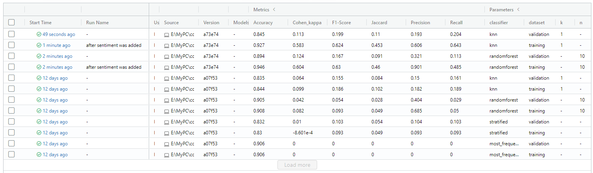

# Documentation - [Patoali](https://trello.com/b/3pj6SkWa)

This document presents the author's work on the 'Machine Learning in Practice' project which took place during the summer term 2021 as a block seminar at Osnabrück University. The given task was to analyze a data set containing data science related tweets and predict whether a tweet will go viral or not by applying machine learning techniques. A tweet is defined as viral if it exceeds the arbitrary threshold of the sum of 50 likes and retweets. The data set _Data Science Tweets 2010-2021_ contains _data science_, _data analysis_ and _data visualization_ tweets from verified accounts on Twitter from 2010 til 2021. It was collected and [shared on kaggle.com](https://www.kaggle.com/ruchi798/data-science-tweets) by Ruchi Bhatia.

The lecturer Lucas Bechberger provided his students with a foundational codebase which makes heavy use of the python library scikit-learn. The codebase consists of multiple python (`.py`) and bash (`.sh`) scripts that resemble a basic pipeline of the processing steps _preprocessing_, _feature extraction_, _dimensionality reduction_ and _classification_ which is common for machine learning projects. The shell scripts invoke the python scripts with a particular set of command line arguments. Shell scripts can be used to run the entire pipeline or to execute only individual steps to save time. Results of the pipeline steps are stored in `.pickle` files to reuse them in a separate application. The application offers a rudimentary read–eval–print loop to predict the virality of the tweet a user inputs. The students task was to understand the code base and extend or replace given placeholder implementations with proper solutions to improve and measure the virality prediction.

## Evaluation

Before taking a look at the implemented metrics for judging the prediction performance of various models, some specifics about the data set at hand need to be considered. The raw data consists of the three `.csv` files _data science_, _data analysis_ and _data visualization_. In a first preprocessing step they are appended respectively to form one big data set. In a next step the data is labeled as viral or not viral according to the above mentioned threshold rule. The resulting data set consists of 295.811 tweet records with a distribution of 90.82% non-viral and 9.18% viral tweets. Such an uneven distribution of labelling classes is often referred to as an imbalanced data set. This fact has to be taken into account when comparing the results of baselines with classifiers and the selection of suitable metrics.

    
    
Fig. 1: Shows the performance of the sklearn DummyClassifier with the strategies 'stratified' and 'most_frequent' on a training and validation data set for all implemented metrics.

For the baselines a `DummyClassifier` from the sklearn package was used with the `strategy` `most_frequent` and `stratified`. The former determines non-viral tweets as the most frequent class and therefore predicts every sample as non-viral. Fig. 1 shows that this rather dumb prediction strategy results in a high accuracy of 90.6%. This is the case, because the calculation of the accuracy metric is based on how many predictions have been correct. Since the data set contains mostly non-viral tweets, the prediction is correct most of the time with a percentage that is similar to the data set's class distribution. The slight difference in the percentage can be explained by the removal of some samples during the preprocessing step.

The `stratified` strategy makes prediction by respecting the training set’s class distribution. Again the accuracy has a high value of 83.2% on the validation set. In two observations the accuracy metric performs well on baselines indicating that it is not useful for the imbalanced data set and therefore can be dismissed entirely. The other metrics _Precision_, _Recall_, _F1-Score_, _Cohen's Kappa_ and _Jaccard Score_ are not null this time, but still have a very low value roughly between 0 and 0.1 which is a bad result. Some considerations about the remaining metrics are discussed in the following paragraphs.

When selecting metrics, the use case should be taken into account. An average twitter user would expect that most send tweets will not go viral. When such a user would type a potential tweet into our application to find out if it is going to be viral, it is important to detect a tweet which would go viral as such. This can be captured by the recall metric which asks the question _"How many of the true positives did I catch?"_. On the other hand, it would be annoying if the application is not critical enough and classifies a lot of tweets as viral that don't go viral in practice. Such a high rate of false positives is captured by the precision metric which asks _"How many positively classified ones are actually positive?"_. Therefore, both recall and precision are good metrics for the use case.

Since the F1-Score combines both recall and precision as a weighted average in a single score, it is a practical approach to ignore the former two and instead just focus on the F1-Score alone. Furthermore, Cohen's Kappa is a good condidate for an imbalanced data set. In its calculation the accuracy is used, but adjusted by the probability of random agreement and therefore considered as a more robust measure than simple percent agreement calculations. In addition, the Jaccard Score leaves out false negatives in its calculation. Since it can be expected that this is the most frequently appearing type of result in a confusion matrix, the Jaccard Score is also well-suited for the data set. All in all, the metrics _F1-Score_, _Cohen's Kappa_ and _Jaccard Score_ are used to judge about the models prediction performance by comparing the scores of the model two the scores of the chosen baselines.

## Preprocessing

In this section it is explains what kind of preprocessing operations are applied to prepare the data for the feature extraction and training in later steps of the pipeline and improve the overall prediction performance.

### Preprocessing in General & Provided Preprocessors

After the above mentioned actions of appending the raw data set to a big one and labeling it, a few more preprocessing operations are performed. These operations are useful to improve the performance of models. Usually models cannot process prose or text in general and therefore need the textual data to be tranformed into numerical values. The applied operations are organized in their own preprocessor classes by inheriting from the sklearn classes `BaseEstimator` and `TransformerMixin`. The first two preprocessors `PunctuationRemover` and `Tokenizer` were already provided by the lecturer. The former removes ACII characters which are considered punctuation characters from the tweet column and saves them in a new column. This should result in mostly pure text. The latter takes a text column as the input and splits the text into an array of one word per element. The resulting data of both preprocessors is well-suited to perform NLP techniques on it during the feature extraction step.

### NonEnglishRemover & ColumnDropper

Two more processors were implemented. First, the `NonEnglishRemover` removes all data rows that are labelled as being non-english. This was done after exploring and visualizing the data set in [`visualization.py`](../src/visualization.py). As can be seen in [Fig 2.](./imgs/distribution_of_tweets_per_language.png) the majority of tweets is labelled as english (95.57%). The removel of non-english tweets is useful, because most pre-trained NLP models or other NLP techniques are optimized for english texts. Additionally, next biggest languages only has 3492 records, which is to little to perform any meaningful machine learning on it. It should be noted though, that there are still some non-english tweets in the data set after performing the operation, because they were labeled wrong. Because this misslabeling is seldom, they can be regarded as noise and must not be further taken into account.
Second, `ColumnDropper` removes columns that are not needed. This is simply for the convenience of having less columns when looking at the preprocessed data set which is saved as an intermediate data set.

### TweetCleaner (removes Hashtag, URL and usernames)

Further obvious preprocessing operations are the removal of hashtags, URLs and twitter usernames from the tweet. The implementation of this preprocessor was done in the `Tweetclean` branch, but not entirely finished. It is expected that leaving these elements in the tweet would decrease the performance of various NLP techniques, because they are not trained on such words.

    

Fig. 2: The majority of tweet records are labelled as english. The amount of non-english tweets is too small to be usefull for machine learning.

## Feature Extraction

Besides the already given `CharacterLengthFE`, two more feature extractors have been implemented, namely `CounterFE` and `SentimentFE`. The former is applied to multiple columns and thereby creates multiple features. In general, the feature extractors inherit from a custom `FeatureExtractor` class which in turn inherits from the sklearn classes `BaseEstimator` and `TransformerMixin`. This is done to collect the features and store them in a `.pickle` file for later use in the application.

### CounterFE

The `CounterFE` takes an input column. Suitable columns for this task contain in principle a list of items. But because the data set is read from file the list has been wrapped in double quotes as a string. Therefore the string contained in every data cell of the column is parsed as a python list by applying (`pandas.DataFrame.apply` [^1]) the `litera_eval` function [^2] from the `ast` package. Then the length of the list for each cell is saved by outputting a column with single integer values in a new column. The new column keeps the original name plus an appended `_count`. 

The data set contains the countable columns *mentions*, *photos*, *hashtags*, *urls*, *cashtags*, *reply_to* and *tweet_tokenized*. The motivation for chosing these columns was to gain information about the virality of tweet by counting for example the amount of photos, used hashtags and urls of a particular tweet. The following table shows an example what the input for the hashtag column could look like and the corresponding output of the feature extractor.

| input coulmn                                                      | output column |
|-------------------------------------------------------------------|-------------- |
| "['energy', 'visualization', 'data']"                             | 3             |
| "[]"                                                              | 0             |
| "['flutter', 'webdevelopment', 'mobiledev', 'datavisualization']" | 4             |

### SentimentFE

The `SentimentFE` feature extractor makes use of a sentiment analyzer. The idea is to analyze the sentiment of the tweet text itself by passing it as an input column. It is assumed that tweets which elicit a strong positive or negative emotion are more likely to go viral. For this task the VADER (Valence Aware Dictionary and sEntiment Reasoner) analysis tool was used. It is lexicon and rule-based tool specifically attuned to sentiments expressed in social media. [^3] VADER even supports slang and takes the author's emphasis by capitalizing words into account. Therefore, it should be well-suited for analyzing tweets.

VADER is applied on the tweet and automatically analyzes the sentiment of the whole tweet, even if it contains multiple sentences. The calculated *positive*, *neutral* and *negative* polarity scores are floating point number between 0 and 1 that sum up to a total of 1. Only the positive and negative scores are used, since the neutral score is always the remainding value to sum up to 1 and therefore contains no new information. Both scores are stored in the output column. It is noteworthy that VADER also offers a compound score which is a normalized, weighted composite score in a single number between -1 and 1. Using this value would have been a good alternative to using the positive and negative score. The following table shows a few example input texts and their corresponding VADER scores.

| input                                                    | output                                                        |
|----------------------------------------------------------|---------------------------------------------------------------|
| VADER is smart, handsome, and funny.                     | {'pos': 0.746, 'compound': 0.8316, 'neu': 0.254, 'neg': 0.0}  |
| VADER is VERY SMART, uber handsome, and FRIGGIN FUNNY!!! | {'pos': 0.706, 'compound': 0.9469, 'neu': 0.294, 'neg': 0.0}  |
| Today SUX!                                               | {'pos': 0.0, 'compound': -0.5461, 'neu': 0.221, 'neg': 0.779} |
| Catch utf-8 emoji such as 💘 and 💋 and 😁              | {'pos': 0.279, 'compound': 0.7003, 'neu': 0.721, 'neg': 0.0}  |
| Not bad at all                                           | {'pos': 0.487, 'compound': 0.431, 'neu': 0.513, 'neg': 0.0}   |

## Dimensionality Reduction

## Classification

SelectKBest dimensionality was tried, but did not help.

    

Fig. 3:

## Testing

Three additional tests have been implemented to ensure the intended functionality of the metrics calculations and two features extractors. The test are located in a sub-folder of the corresponding implementation they are testing so that both test and implementation lie close together.

- [metrics_test.py](..\src\classification\test\metrics_test.py)
- [count_test.py](..\src\feature_extraction\test\count_test.py)
- [sentiment_test.py](..\src\feature_extraction\test\sentiment_test.py)

Test implemented, but corresponding implementation not entirely finished (branch `Tweetclean`):

- [tweet_cleaner_test.py](..\src\preprocessing\test\tweet_cleaner_test.py)

---

## References

[^1]: https://pandas.pydata.org/pandas-docs/stable/reference/api/pandas.DataFrame.apply.html

[^2]: https://docs.python.org/3/library/ast.html#ast.literal_eval

[^3]: Taken from https://github.com/cjhutto/vaderSentiment#vader-sentiment-analysis

    VADER (Valence Aware Dictionary and sEntiment Reasoner) is a lexicon and rule-based sentiment analysis tool that is specifically attuned to sentiments expressed in social media. It is fully open-sourced under the [MIT License] (we sincerely appreciate all attributions and readily accept most contributions, but please don't hold us liable).
